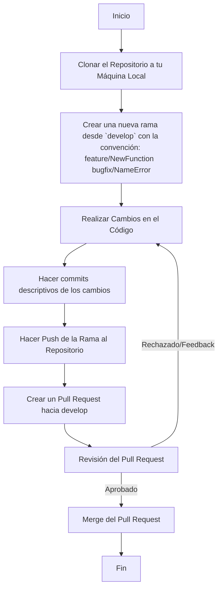
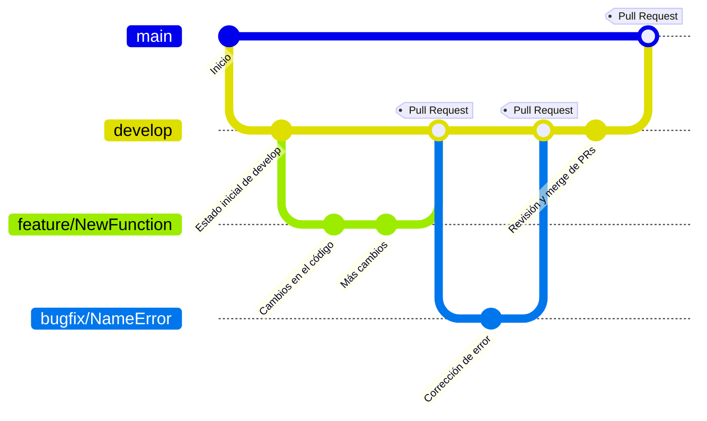

### Flujo de trabajo

```mermaid  
graph TD    
    A[Inicio] --> C[Clonar el Repositorio a tu Máquina Local]
    C --> D[Crear una nueva rama desde `develop` con la convención: feature/NewFunction  bugfix/NameError]
    D --> E[Realizar Cambios en el Código]
    E --> F[Hacer commits descriptivos de los cambios]
    F --> G[Hacer Push de la Rama al Repositorio]
    G --> H[Crear un Pull Request hacia develop]
    H --> I[Revisión del Pull Request]
    I -->|Aprobado| J[Merge del Pull Request]
    I -->|Rechazado/Feedback| E
    J --> K[Fin]
```  
### Estructura de ramas:

```mermaid  
gitGraph
    commit id: "Inicio"
    branch develop
    checkout develop
    commit id: "Estado inicial de develop"
    branch feature/NewFunction
    checkout feature/NewFunction
    commit id: "Cambios en el código"
    commit id: "Más cambios"
    checkout develop
    merge feature/NewFunction tag: "Pull Request"
    branch bugfix/NameError
    checkout bugfix/NameError
    commit id: "Corrección de error"
    checkout develop
    merge bugfix/NameError tag: "Pull Request"
    commit id: "Revisión y merge de PRs"
    checkout main
    merge develop tag: "Pull Request"
```  
